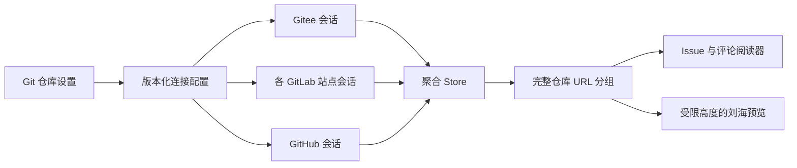

# ADR-0003：Git 仓库聚合阅读器

状态：实现；真实账户联调与手工界面验收另行记录。

## 范围

定制版保留原生 Issue 阅读窗口和刘海预览，将设置入口统一为「Git 仓库」。Gitee、GitHub.com 和多个 GitLab 站点可以同时连接。一个站点保存一个账户；同站点多账户和 GitHub Enterprise 不在本次范围。只读，不修改平台的 Issue、评论、Watch 或 Star，不改变媒体、锁屏、Thaw、签名和更新行为。

## 连接与展示



`GIStore.remote` 只表示设置中正在编辑的站点。请求客户端、分页、账户、取消代数、错误与仓库选择属于各自的 `GISiteSession`；阅读由 Issue 路由中的站点决定。一个连接退出、停用或令牌失效，只清除对应内容及历史。关闭整个功能取消全部请求并清除私有内存内容。迟到响应必须通过连接及请求代数验证，不能恢复已取消的内容。

仓库分组键为从受信站点及 API 路径构造的完整网页 URL，保留 GitLab 子组、端口和反向代理前缀。数字仓库 ID 仅在所属站点内部用于元数据对账。Issue 的标识包含站点、仓库路径与字符串编号；不同平台同名仓库和同编号不会覆盖。Watch/Star 中的同仓库去重。分组显示空、失败、加载中和分页状态，数量只表示已加载/匹配数量，不宣称仓库总量。列表组按 URL 排序，组内按解析后的更新时间排序。

## 平台与分页

Gitee/GitLab 复用原生 REST 适配器；GitHub 使用固定 `https://api.github.com` 及独立凭据。GitHub DTO 将数字编号转换为字符串，并过滤 `pull_request`。分页元数据在过滤之前从 `Link` 的 `rel="next"` 读取，整页是 PR 也不会提前终止。分页 URL 必须与当前请求的可信主机和路径一致，请求仍由客户端重新构造。连接间独立加载，同一 GitHub 客户端排队，并尊重限流恢复时间。

GitHub 私有仓库令牌必须覆盖目标仓库并允许读取 Issues；Watch/Star 列表还需要对应的账户读取权限。不能把仓库发现接口的权限不足推断成所有 Issue 都不可读。

## Gitee 状态投影

显示文本、状态颜色和筛选共享 `GIStateProjection`。标准状态保留既有语义，兼容 `opened`、`in_progress` 等字符串别名；「未完成」仅包含开启和进行中。可用的 `issue_state.title/name` 原样显示，按「基础状态 + 自定义标题」产生可选择键；未知状态不丢弃，全部筛选可见。数字工作流 ID 不臆测成固定状态，自定义名称也不会把一个 closed Issue 变成未完成。

合成用例验证以上行为；它不等同于已使用维护者账户复现问题。仓库及公共 CI 不接收、保存或打印实际 Gitee 令牌。

## 兼容与隐私

连接清单保存在 `toolisle.reader.connections.v2`，兼容读取原 Gitee/GitLab 选择、折叠状态及最后使用站点，原 Keychain 服务和配置键不删除。迁移可重复执行，原来关闭的功能不自动开启。旧内部符号和窗口标识保留，避免不必要的配置失效。

Token 只通过各自 API 的请求头发送，拒绝 API 重定向，不放入 URL、日志、正文或 UserDefaults。图片默认关闭，不发送 Token；跨站点正文切换重建 WebView 的 CSP，并重置图片同意状态。仅已配置且已连接的站点可内部跳转，其他站点链接交给浏览器。权限失效清除相关缓存；临时网络错误允许显示明确标记的旧内容。

## 验证

- `bash scripts/test_git_reader.sh`：生产模型/适配器的离线 Swift 用例及既有 Python 结构回归。
- macOS 完整 Debug 构建后：`DERIVED_DATA=/path/to/DerivedData bash scripts/test_git_reader_native.sh`，链接实际构建的 Defaults 模块，测试未经转换的生产 Store。使用独立 UserDefaults suite、模拟凭据及模拟服务，不碰真实 Keychain。
- `.github/workflows/git-reader-regression.yml`：完整原生应用编译和上述回归，保存源提交及日志。
- 实体 Mac 手工验收：三平台仓库同时加载、长 URL、刘海折叠与高度、中文输入、跨站点正文/图片/前后退、各平台真实权限和评论锚点。

需要只读检查实际 Gitee 状态字段时，在可信本机运行：

```sh
python3 scripts/diagnose_gitee_states.py --repository owner/repo --pages 2
```

工具通过隐藏输入读取 Token，仅向固定 Gitee API 请求所指定仓库，拒绝重定向，只输出状态字段频次，不输出 Issue 标题、正文、作者或凭据。它是有上限的样本诊断，不是全库统计。不要把 Token 写在命令行、Issue、PR、脚本或公共 CI 中；已经公开发送的 Token 应撤销并更换。
