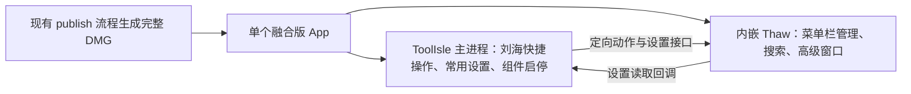

# ToolIsle 与 Thaw：单 App 融合方案与验证计划

评估及实现日期：2026-09-26。产品边界与总体方案见 [ADR-0001](../adr/0001-menubar-integration-product-boundaries.md)，代码摆放与架构见 [ADR-0002](../adr/0002-thaw-source-and-host-layout.md)。主应用适配、原生设置、刘海快捷菜单、统一启停及 Thaw 发行补丁已实现。此前 Release、完整 DMG 构建及签名/物料静态检查虽已通过，用户安装后仍发生 helper 启动失败；静态签名有效不代表动态库能被系统成功加载。修正版完整 DMG 已构建成功，包内 helper 的真实可执行加载、签名与物料检查均通过；实际权限与菜单栏交互仍无通过验收的结论。
修正版：[112826-MKmwC8 / BangsBuddy-2.3.3-1644-arm64.dmg](/Users/daizhihao/amazing/ToolIsle/publish/2026-09-26/112826-MKmwC8/BangsBuddy-2.3.3-1644-arm64.dmg)。退出旧应用后覆盖安装。
旧产物（**已知 helper 启动失败，不作为可用版本交付**）：[105247-i9EMk8 / BangsBuddy-2.3.3-1644-arm64.dmg](/Users/daizhihao/amazing/ToolIsle/publish/2026-09-26/105247-i9EMk8/BangsBuddy-2.3.3-1644-arm64.dmg)。
基线固定为 Thaw 2.0.1（`d5eab80b4e1f62328a8b130994220e49524a48d1`）；当日 GitHub 查询仍为最新稳定版，Ice 最新稳定版仍为 0.11.12。
本地 ToolIsle 基线为 `d93be4a5a0c511239451350133d87a5741cccc1f`。沿用[Ice 对比](ice-vs-thaw.md)的接口结论，选择 Thaw 可复用已有控制及设置协议，Ice 需要另补控制入口。

## 已知启动失败与修复验证

- **复现与根因**：旧 `105247-i9EMk8` 产物安装后，内嵌 Thaw 在 dyld 加载阶段触发 SIGABRT；28 份崩溃记录及两次直接执行均指向同一原因：开启 hardened runtime 的 ad-hoc 签名 helper 加载同样为 ad-hoc、无 Team ID 的 Sparkle 动态库时，被 library validation 拒绝。失败发生在权限引导与菜单栏逻辑之前。
- **此前验证的遗漏**：`codesign --verify --deep --strict`、身份、架构及物料摘要检查只能证明对应静态属性；旧包这些检查通过，仍没有覆盖实际进程加载。此前静态结果保留为历史记录，不能继续推导旧包可启动。
- **修复范围**：managed 集成发行版的 `UpdatesManager` 改为编译期禁用实现，并移除其 Sparkle link/product；原上游实现在 `#else` 中保留。继续保留 hardened runtime 与 library validation，不通过关闭它们绕过失败，也不修改菜单栏核心算法。
- **新增加载检查**：真实 helper 可执行文件提供 `--toolisle-launch-check`，在进入 AppKit 应用生命周期前输出指定 sentinel 并退出。只有实际动态库加载成功才能执行到该分支；该检查不打开 GUI、不申请权限、不启动菜单栏管理。构建及整包验证应执行该检查，而不只检查退出码或签名。
- **已验证范围**：修正后的单 helper Release 构建通过，`build.py` 内置的真实 pre-AppKit 加载检查通过；[加载回归检查](../../tests/test_thaw_launch.py)对同一修正 helper 再次运行通过。相同检查对旧已安装包返回 Exit -6，覆盖了旧包失败、新 helper 通过的差异。此次补丁 SHA 为 `ee50342434087e8c132b917350ee1c9fae792ccd34dd15b161032816a3a258ff`。
- **最终整包验证**：`publish/2026-09-26/112826-MKmwC8` 的完整 DMG 已构建并只读挂载；对包内实际 helper 重做加载回归通过。主应用/helper/XPC 的 arm64 架构与嵌套签名、helper/XPC 的 hardened runtime 与无调试/库校验豁免权限、无 Sparkle 依赖或残留框架、嵌入配方与摘要均通过。DMG SHA256 为 `c2217d558d30ac8a53c568661024be4223e9774f4d426e875936e6c35fe8bb28`。通过加载检查仍不等于 GUI、TCC、XPC、设置读回或菜单栏行为已验收。

## 已确认的方案

用户已明确要求“只安装一个 App，设置和功能尽量统一”。已按 **C：ToolIsle 主 App 内嵌 Thaw.app helper，主 App 提供统一入口和常用设置，Thaw 以独立进程处理菜单栏**完成实现和构建。
用户已接受“一个 App”指只安装一个外层应用包，内部可以有辅助进程；搜索与图标排序等高级操作可使用独立窗口。系统若要求辅助组件单独授权也可接受，但实际权限身份与授权保留仍需验证。内嵌方案已通过编译及整包构建，暴露的动态库加载问题已修复并通过真实加载回归；运行集成仍待实机验收。
已接入“切换隐藏区”“搜索菜单栏”“打开 Thaw 设置”，以及单 App 打包、统一启停、整包手动升级和常用原生设置；这些实现尚不代表端到端行为已通过。完整布局编辑暂由 Thaw 自有窗口承载。

首版功能清单已确认：三个操作入口，加自动重新隐藏（方式与定时延迟）、鼠标悬停展开（等待时间）、当前屏幕 Thaw Bar 开关。ToolIsle 设置页、菜单及刘海面板提供相应入口；刘海仅提供快捷操作，搜索与完整布局编辑仍使用独立窗口。高级窗口保留 Thaw 名称与原生界面，不做全量品牌与样式统一。

首次安装后不启动菜单栏组件、不改变原有菜单栏状态；用户从刘海入口主动启用并完成权限引导。之后记住启用选择，随主 App 启停。

已确认的运行结构（尚待实机验证；内部已有 XPC 等进程未逐一展开）：

用户已接受把必要修改集中在调用入口、设置适配、启动与发行配置，保留双方上游源码边界，符合[北极星目标](../north-star.md)允许清晰局部修改的原则；不修改菜单栏核心算法。若集中补丁无法满足需求，先让用户取舍，不自行扩大到核心修改。
**A：原生小模块 + 独立安装 Thaw**与 **B：独立 Bridge + 扩展网页**只作为交付要求放宽后的低成本备选，均不满足当前只安装一个 App 的要求。
三种方案都依赖同一组公开 URI；把应用包放在一起或增加 Bridge，不会让 Thaw 自动提供图标嵌入能力。

## 单 App 主方案的边界

- **主 App 负责**：统一入口、刘海快捷操作、常用设置 UI、内嵌 helper 的定位与启动、兼容版本记录。首版应用升级由完整 DMG 手动替换完成。
- **Thaw 负责**：菜单栏图标管理、搜索及完整布局窗口。双进程保留其内部实现和大部分上游演进空间。
- **设置统一**：原生 UI 通过 `get/set` 及回调操作白名单设置；仍需 Thaw 的 Settings URI 开关、调用者身份授权。`set` 没有成功回调，需要读回确认，不能仅持久化一份主 App 的镜像状态。
- **权限与授权归属**：一个外层应用包不保证只有一个 TCC 授权身份；签名、可执行文件身份、首次权限弹窗和升级后的授权保留需实机验证。
- **内嵌身份**：构建带独立身份的 Thaw helper，系统性核对主 target、内部 XPC、URL 注册和签名关系；只改显示名称不够。使用明确的内嵌应用路径派发命令，避免误开独立安装版。独立身份也不能使两套菜单栏管理器安全同时工作；检测到另一管理器运行时提示用户先退出，不擅自终止。
- **统一升级**：首版沿用 `publish/` 构建完整 DMG，手动替换整个融合版 App；已停用父、子应用的独立更新入口和后台更新启动。适配包含 Sparkle 初始化、检查入口及界面，不只是修改 Info.plist；整包替换后的实际行为仍需验收。
- **集中补丁**：已对原版更新、登录启动及自主重启行为进行集成发行适配；高级窗口允许保留原生行为，仅在影响已确认体验时调整。集中维护补丁并固定上游版本，未抽取 Thaw Core，也未合并菜单栏算法。

这是待验证的嵌套运行方案，不是 Thaw 官方提供的 helper 产品。Apple 将 `Contents/Helpers` 列为辅助应用标准位置，并要求内层代码先签名、外层最后签名。[Apple TN2206](https://developer.apple.com/library/archive/technotes/tn2206/)

## 实现位置

- **ToolIsle 原生 UI**：新功能集中放在 `DynamicIsland/ToolIsleFeatures/Thaw/`；`DynamicIslandApp.swift` 增加菜单入口，`components/Settings/SettingsView.swift` 登记设置页及搜索，`components/Notch/DynamicIslandHeader.swift` 在现有工具按钮行加入快捷菜单，不增加新的刘海 tab。AppDelegate 优先分派 `toolisle-thaw` 回调，保留 Shelf 文件接收；Info.plist 注册回调 scheme。
- **定向调用及设置**：按内嵌路径使用 [NSWorkspace 指定应用打开 URL](https://developer.apple.com/documentation/appkit/nsworkspace/open(_:withapplicationat:configuration:completionhandler:))；接收端校验 scheme、host、随机 requestId、JSON 类型和范围。设置仍由 Thaw 保存，使用明确 `set` 后 `get` 读回，超时显示未确认。首批已选自动重新隐藏、悬停展开与当前屏幕 Thaw Bar；具体字段与语义见下文，首次授权保留正常流程。
- **Thaw 发行补丁**：[Updates.swift](https://github.com/thaw-app/Thaw/blob/d5eab80b4e1f62328a8b130994220e49524a48d1/Thaw/Main/Updates.swift#L159)有集中更新入口，但设置展示和菜单也会触发；[GeneralSettingsPane](https://github.com/thaw-app/Thaw/blob/d5eab80b4e1f62328a8b130994220e49524a48d1/Thaw/Settings/SettingsPanes/GeneralSettingsPane.swift#L51)有自己的登录开关。集成发行版由父应用统一接管这些行为。
- **窗口及实例**：[AppDelegate](https://github.com/thaw-app/Thaw/blob/d5eab80b4e1f62328a8b130994220e49524a48d1/Thaw/Main/AppDelegate.swift#L192)会终止相同 bundle ID 的其他实例；同文件 `openSettingsWindow` 会切换 regular 激活模式。日常设置迁到父应用；若保留完整布局窗口且要求 Dock 也统一，需验证调整后的焦点与菜单行为，不能只改 LSUIElement。
- **签名及退出**：保留 [MenuBarItemService 内部协议](https://github.com/thaw-app/Thaw/blob/d5eab80b4e1f62328a8b130994220e49524a48d1/Shared/Services/MenuBarItemService.swift)和[同 Team 校验](https://github.com/thaw-app/Thaw/blob/d5eab80b4e1f62328a8b130994220e49524a48d1/MenuBarItemService/Listener.swift#L88)。[退出流程](https://github.com/thaw-app/Thaw/blob/d5eab80b4e1f62328a8b130994220e49524a48d1/Thaw/Main/AppDelegate.swift#L147)会恢复菜单栏项目，父应用退出/升级应请求正常退出并确认结束，不能直接强杀。
- **构建和更新**：已扩展 `publish/publish.sh`，把完整 helper 放进 `BangsBuddy.app/Contents/Helpers/`，保留依赖并从里到外签名，记录双方 commit 和补丁。ToolIsle 基线的更新配置指向 Atoll 官方源；当前实现已停用父、子应用独立更新，保留的上游源地址不表示融合版会继续检查或安装上游包。首版采用完整 DMG 手动升级。

## 现有 DMG 发布流程的接入点

已扩展 [`publish/publish.sh`](../../publish/publish.sh) 并执行完整构建。脚本保留原有 arm64 Release 构建、复制为 `BangsBuddy.app`、显示名调整、外层重签、签名验证、DMG 生成与验证，以及 SHA256 和构建信息记录；新流程见[发布说明](../publishing.md)。

- 复制主 App 后调用 `integrations/thaw/build.py` 构建完整 helper，嵌入 `Contents/Helpers/Thaw.app`，最后签名外层 App；构建记录包含 Thaw commit、归档摘要、补丁摘要及组件身份。
- 原脚本只重签外层，`--deep` 用于验证。新增 helper 构建保留各自 entitlements，Release 关闭调试授权注入。旧 `105247-i9EMk8` DMG 只读挂载后确认只有一个外层 App，host/Thaw/XPC 身份与 arm64 架构正确，`--deep --strict` 签名验证通过且均无 `get-task-allow`，但随后实际启动仍因 Sparkle 库验证失败而崩溃。源码中已有的无 Team XPC 校验分支不能解决 dyld 库加载问题；真实 XPC 运行和授权归属仍待实机验证。
- 旧包物料核对曾通过：内嵌 lock、patch、build 脚本和 README 与当时工作区逐字一致，归档 SHA 与 lock 一致，重启补丁存在，Info 中 commit/patch SHA 与 package.json 一致，父更新 Info 已关闭，DMG SHA 一致。本地静态记录为 `.build/thaw-host/verified-package.txt`（忽略文件，不随 Git 提交）；该记录不代表旧包可启动，也不覆盖本轮尚未生成的新包。
- 已停止主应用 Sparkle 初始化启动，并由 delegate 拒绝更新检查；共用更新界面显示 DMG 整包升级说明。Thaw 发行补丁停用独立更新、登录启动控制和自主重启；仅从主 App 统一重启，不保留绕过正常退出的 helper 重启路径。
- `ThawController` 负责组件定位、定向派发和设置读回；`ThawAppLifecycle` 在主 App 退出时等待组件正常结束，再允许退出或启动替代主进程。

## 已固定的接口事实

| 能力 | 2.0.1 入口 | 对控制面板的含义 |
| --- | --- | --- |
| 切换隐藏区 | `thaw://toggle-hidden` | 是反转当前状态，不能表达“确保隐藏”或“确保展开” |
| 打开搜索 | `thaw://search` | 打开 Thaw 搜索窗口，不能返回搜索结果用于刘海内展示 |
| 打开设置 | `thaw://open-settings` | 打开 Thaw 自己的窗口，完整布局编辑留在那里 |

事实来源：[固定版本 URI 文档](https://github.com/thaw-app/Thaw/blob/d5eab80b4e1f62328a8b130994220e49524a48d1/docs/URI_SCHEMES.md)、[解析器](https://github.com/thaw-app/Thaw/blob/d5eab80b4e1f62328a8b130994220e49524a48d1/Thaw/Utilities/SettingsURIParser.swift)、[AppDelegate 派发](https://github.com/thaw-app/Thaw/blob/d5eab80b4e1f62328a8b130994220e49524a48d1/Thaw/Main/AppDelegate.swift)。

- 三个基本动作直接派发，不经过 Settings URI 设置开关及调用者白名单；仍需满足 Thaw 运行所需的系统权限。
- 基本动作没有完成结果回调。发起端成功打开 URL 只代表请求已交给应用，不能据此显示“隐藏成功”或保存真实显隐状态。
- 已检查的公开接口不提供菜单栏图标列表、图标流、单图标远程移动/点击或 Thaw Bar 视图嵌入；这些方案都不能靠三个动作把完整菜单栏搬进刘海。
- `get/set/toggle` 设置接口需要 Settings URI 开关、身份与授权处理；读取完整结果需要回调接收端。三个基本按钮自身不需要这些机制，统一设置的阶段需要按实际设置接入。

以上边界依据同一组固定版本文档及[SettingsURIHandler](https://github.com/thaw-app/Thaw/blob/d5eab80b4e1f62328a8b130994220e49524a48d1/Thaw/Utilities/SettingsURIHandler.swift)；否定结论限于已核查的公开接口。

首版原生设置清单（用户已确认 7A）：

| 设置组 | 已有字段 | 界面需表达的语义 |
| --- | --- | --- |
| 自动重新隐藏 | `autoRehide`、`rehideStrategy`、`rehideInterval` | 支持智能、定时、切换前台应用三种方式；延迟为 1–300 秒，仅定时方式下有意义 |
| 鼠标悬停展开 | `showOnHover`、`showOnHoverDelay` | 悬停在菜单栏空白区域展开；等待时间为 0–5 秒 |
| 当前屏幕 Thaw Bar | `useIceBar`，可指定 `display=UUID` | 在菜单栏下方独立浮条中显示隐藏图标；按显示器保存，不传显示器参数时针对当前活动菜单栏所在屏幕 |

以上字段与范围来自同一固定版本的 [URI 文档](https://github.com/thaw-app/Thaw/blob/d5eab80b4e1f62328a8b130994220e49524a48d1/docs/URI_SCHEMES.md)和[设置白名单](https://github.com/thaw-app/Thaw/blob/d5eab80b4e1f62328a8b130994220e49524a48d1/Thaw/Utilities/SettingsURIHandler.swift#L30)。设置入口按钮建议写“更多菜单栏设置…”，因为 `open-settings` 打开整个 Thaw 设置窗口，不能直接定位其 Advanced 子页。所有已选项均未完成融合版端到端验证。

## 两种独立安装备选

| 维度 | A：ToolIsle 原生小模块 + 一个 UI 挂点 | B：独立 Bridge + 扩展网页 |
| --- | --- | --- |
| 主体改动 | ToolIsle 新文件及局部 UI 入口；Thaw 零修改 | 目标是两边主体零修改；新增独立应用 |
| 调用链 | 原生按钮 → 系统打开 URI → Thaw | 扩展网页 → Bridge 本机端点 → URI → Thaw |
| 首期工作 | 三按钮、固定动作映射、安装检测和错误提示 | 同样三动作，再加扩展注册、网页、本机端点及 Bridge 生命周期 |
| 权限与身份 | 使用 ToolIsle 现有应用身份；基本动作无新增设置授权流程 | 需启用扩展、网页交互和本机访问；基本动作也不需要设置授权 |
| 上游冲突 | 主要检查少数 UI 挂点是否因上游重构而变化 | 没有主体合并冲突，但仍需跟进扩展协议和 WebView 策略变化 |
| 发布和排障 | 两个应用；ToolIsle 控制功能随定制版交付 | 三个应用；需单独处理 Bridge 安装、启动、版本和更新 |
| 原生体验 | 复用 ToolIsle 的按钮和反馈方式 | 控制页受扩展网页容器约束 |
| Thaw 升级兼容 | 检查相同 URI 动作行为 | 检查相同 URI 动作行为，Bridge 不消除这项工作 |
| 适用条件 | 接受局部挂点修改，希望总体维护量小 | 主体零修改是硬约束，愿意维护额外应用 |

B 的额外路径源于现有 WebView 拒绝直接导航到 `thaw://`；需由 Bridge 接收网页请求再原生派发。
本地事实、SDK 基线和相关源码路径见[前次调研“ToolIsle 的现有接入点”](thaw-integration-research.md#toolisle-的现有接入点)；端到端尚未验证。
上述成本比较是基于组件与调用路径的工程判断，不是已经测得的工时或冲突率。

## 实现时的动作语义

1. 按钮明确写“切换隐藏区”，不要做成声称知道真实状态的开关，也不要命名为“隐藏”或“展开”。
2. 一次用户操作只派发一次；禁止超时后自动重试 `toggle-hidden`。第一次可能已生效，再发一次会把状态反转回来。
3. 只抑制同一次操作的重复派发，不用长期禁用按钮冒充结果确认；用户仍可主动再次点击。
4. 交付失败时显示“无法打开 Thaw”；成功交付时至多表示请求已发出，不能把它当成执行结果。
5. 内嵌 Thaw 缺失时显示安装包不完整并引导修复；不能改为要求用户另装 Thaw。冷启动能否消费首个 URI，需要实机验收。仅 A/B 备选使用独立安装指引。
6. 固定允许的动作和设置键；基本动作不搭建通用插件框架。接入常用设置时再增加明确的回调和读回路径，不扩大为任意 URI 执行器。

这些是由非幂等 toggle 和无结果回调推导的实现约束，不是 Thaw 对完成确认的额外承诺。

## 同步上游与应用升级

- **代码同步**：C/A 把控制文件和 UI 挂点维持为明确的定制差异；C 另记 Thaw 必要发行补丁，B 单独维护 Bridge。均避免复制 Thaw 菜单栏核心。
- **版本记录**：记录 ToolIsle 上游基线、定制提交、验证过的 Thaw 版本和目标 macOS；按验证结果更新兼容范围，不追随开发分支假定兼容。
- **应用升级**：C 首版采用完整 DMG 手动替换整个应用包，不提供内部组件独立更新；A/B 中独立官方 Thaw 可保持官方更新。定制版升级必须保留身份和功能，与 Git 合并区分，见[CONTEXT](../../CONTEXT.md)。
- **交付范围**：C 必须在单个外层 App 中交付所需组件；“一个 DMG 内放两个需要分别安装的 App”不能算完成用户要求。
- **系统范围**：固定版本 Thaw 的最低部署版本为 macOS 26.0，见[项目配置](https://github.com/thaw-app/Thaw/blob/d5eab80b4e1f62328a8b130994220e49524a48d1/Thaw.xcodeproj/project.pbxproj)；更低版本应提示不可用。

## 首次启用与异常处理

用户已选择 10A：首次保持原有菜单栏状态，不启动菜单栏组件；从刘海入口主动启用时，再启动必要的授权流程，完成后进入可用状态。持久化启用选择，后续随主 App 启停；不能把“用户希望启用”直接当成“权限已就绪或组件正在运行”。首次打开主 App 不自动展示 Thaw 授权引导。

首版工程建议是将异常限制在菜单栏功能内，ToolIsle 其余功能继续工作：权限拒绝时提供授权引导；组件缺失或版本不兼容时提示修复完整安装包；进程异常退出时显示不可用并提供手动重试，不建立自动反复重启机制。重试启动组件不等于重放先前动作，尤其不能自动重放切换隐藏区操作。正常关闭菜单栏功能或退出融合版时，应请求 Thaw 正常退出并等待其恢复菜单栏项目；异常退出后的恢复效果需单独验证。

## 实施顺序与验收阶段

1. **先验证内嵌运行条件**：以固定 Thaw 基线验证完整组件嵌入、内部 XPC 通信、由内到外签名、首次权限授权、按路径派发动作与设置读回。优先验证当前自用签名方式的可行性；若不满足，报告实际原因与必要条件，不通过削弱签名或调用者校验来绕过。
2. **再接首版交互与发行适配**：在 ToolIsle 增加刘海快捷入口、设置页、主动启用与运行状态反馈；落实统一启停、保留 Thaw 高级窗口，集中停用双方独立更新及子组件登录启动行为。若需要修改菜单栏核心算法，回到用户决策，不自动扩大范围。
3. **最后验证完整交付与后续同步**：扩展既有 `publish/publish.sh`，补充 Thaw 构建与签名步骤以及版本记录，复用 DMG、日志与校验流程；完成安装、启停、三个动作、常用设置、整包替换后的设置与权限验收。后续引入双方上游更新并再次构建安装，才能验证长期同步闭环。

## 最小验收与尚未验证的部分

1. C 只安装、移动和删除一个外层 App 即可；首次打开主 App 不启动菜单栏组件、不改变菜单栏、不自动展示 Thaw 授权引导。从刘海入口主动启用时找到正确的内嵌 Thaw，已有独立 Thaw 时也不会误派发或启动冲突实例。
2. 确认内嵌 helper 已运行、已退出、缺失或不兼容时的反馈；首个 URI 不丢失、不重复执行。A/B 另验独立 Thaw 未安装。
3. 三个动作各验证一次：隐藏区确实反转，搜索与设置打开正确窗口；系统权限缺失时不报虚假成功。失败/超时不自动重试 toggle。
4. 常用设置验证初始读取、首次授权、修改后读回、拒绝授权与回调超时；主 UI 不显示过期或未经确认的设置值。重启主 App 后保留启用选择，并分别验证启用、停用与权限尚未就绪时的状态。
5. 验证刘海、Thaw 弹出条和设置窗口在多显示器、全屏及切换 Space 时的共存与焦点；静态代码不能证明这些表现。
6. 同步一次后续 ToolIsle 上游并升级一次选定 Thaw 基线，再构建、安装复验；C 还要确认子更新器不独立更新、父升级保留权限和设置。
7. 若采用 B，额外验证扩展关闭、Bridge 退出、本机端点不可用、网页重新加载与 Bridge 升级时的恢复。

代码、UI 挂点与发行补丁已落盘；协议回归 37 项、控制器隔离回归 21 项通过，后者未启动任何真实 helper，因此未覆盖本轮发现的 dyld 启动失败。旧 DMG 的 Release 构建与静态检查通过记录已被实际启动失败补充，不能作为可用性交付结论。修正后的单 helper Release、完整 DMG 构建、最终包内真实加载回归及签名/物料检查已通过；真实 GUI/TCC、首次定向调用、设置授权与读回、正常退出的图标恢复、窗口共存及替换升级后的授权保留仍未验收，后续双方上游同步闭环也尚未执行。
